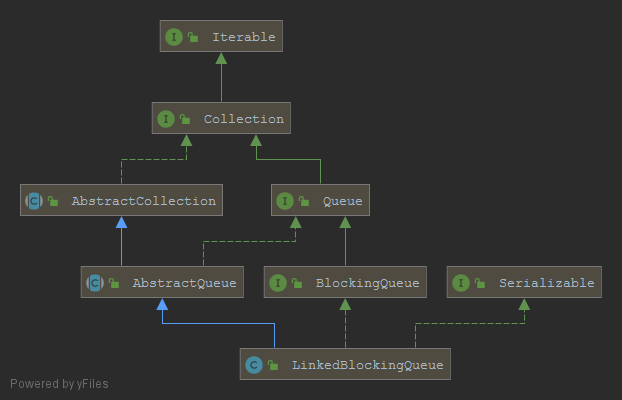

## thought 思想

发现问题->分析问题->解决问题

### Object-Oriented Analysis（OOA面向对象分析方法）
按照面向对象的思想来分析问题,细化分类到具体
- 层次（题层、对象类层、结构层、属性层和服务层）
- 活动（标识对象类、标识结构、定义主题、定义属性和定义服务）
- 结构（分类结构、组装结构）
- 原则（抽象、封装、继承、分类、聚合、关联、消息通信、粒度控制、行为分析）
- 模型（对象模型、动态模型、功能模型）

### Object-oriented Design（OOD面向对象设计）

### Object Oriented Programming(面向对象程序设计)

>> OOA->OOD->OOP

### 设计模式
- [实例代码 basic/src/main/java/org/lxg/basic/patterns](https://github.com/xuegangliu/javaBasic)

### UML
直观快速的了解流程系统等

### blog-links
- [https://www.jianshu.com/p/224d8fc4d0f0](https://www.jianshu.com/p/224d8fc4d0f0)